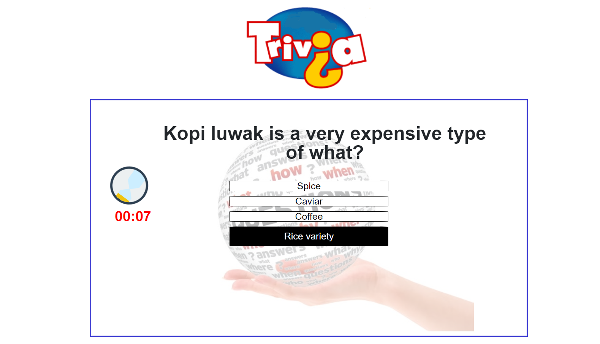

# Trivia Game

## A General Knowledge Trivia

The game shows one question at a time and user will have 15 seconds to anwer. It will have either of the 3 options - Correct, Wrong answer or Timeup. It will be shown through funny emoji images.


## Getting Started 
Play here: https://shraddhabhatt.github.io/TriviaGame/

## Screenshots


Displays time left, question, and highlights option choosen on hover.

## Technologies used
- Bootstrap
- Javascripts
- jQuery

### Prerequisites

```
- Bootstrap: visit http://getbootstrap.com/getting-started/ for the CDN and link in html
- jQuery: visit http://code.jquery.com/ and link in html
```

## Built With

* Sublime Text - Text Editor
* Bootstrap- Wireframe
* HTML/CSS

## Authors

* **Shraddha Bhatt** - *HTML/CSS/JS* - [Shraddha Bhatt](https://github.com/shraddhabhatt)

